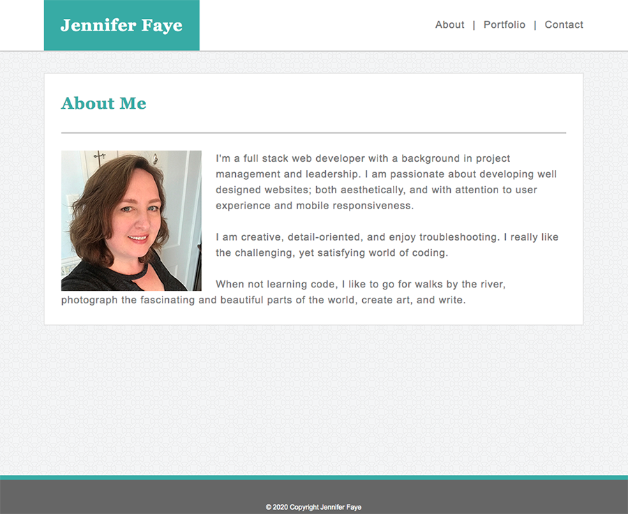
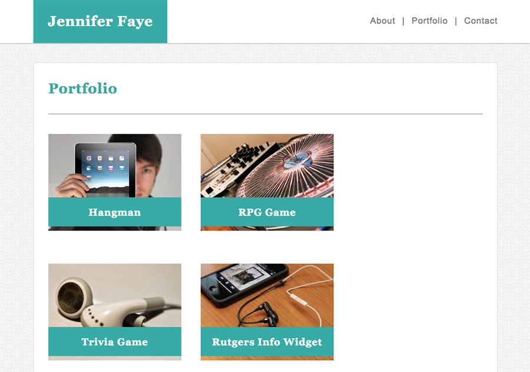
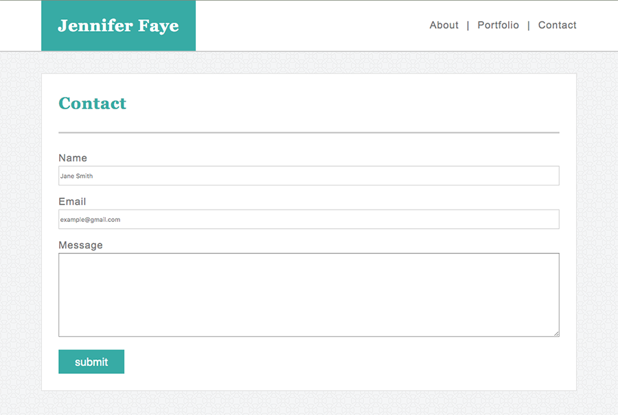

# Basic Portfolio

A basic portfolio for a full stack web developer.  

[Basic Portfolio](https://jennifer0101.github.io/Basic-Portfolio/)

## Description

A portfolio that lays down the basic html and css groundwork to build off of.

The about page has a photo, description, and links.

The portfolio page has a template to hold five projects. 

The contact page displays a form template.

## Built With

* HTML5
* CSS3

